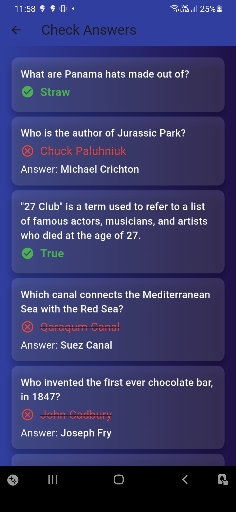

# 🧠 Flutter Quiz App

A fun and interactive quiz app built using Flutter and the [Open Trivia DB API](https://opentdb.com/api.php). Supports multiple choice questions, score tracking, countdown timers, and visual performance feedback.

  
  
  

---

## 🚀 Features

- 📡 Fetches trivia questions from [OpenTDB](https://opentdb.com/api.php)
- ⏱️ Countdown timer for each question
- 📊 Result screen with animated gauge (using Syncfusion)
- 🔁 Retry option and back-to-close behavior
- 🎯 Difficulty and category-based quiz selection (if implemented)
- 🍭 Clean UI with custom clippers, animations & icon support

---

## 📦 Packages Used

| Package | Description |
|--------|-------------|
| [`http`](https://pub.dev/packages/http) | API requests to OpenTDB |
| [`html_unescape`](https://pub.dev/packages/html_unescape) | Decode HTML entities in question strings |
| [`circular_countdown_timer`](https://pub.dev/packages/circular_countdown_timer) | Countdown animation for questions |
| [`syncfusion_flutter_gauges`](https://pub.dev/packages/syncfusion_flutter_gauges) | Performance gauge in result screen |
| [`flutter_custom_clippers`](https://pub.dev/packages/flutter_custom_clippers) | Custom wave designs in UI |
| [`auto_size_text`](https://pub.dev/packages/auto_size_text) | Dynamic text resizing |
| [`double_back_to_close_app`](https://pub.dev/packages/double_back_to_close_app) | Exit app with double back |
| [`font_awesome_flutter`](https://pub.dev/packages/font_awesome_flutter) | Icons |
| [`fluttertoast`](https://pub.dev/packages/fluttertoast) | Toast messages |
| [`loading_animations`](https://pub.dev/packages/loading_animations) | Loading indicators |
| [`cupertino_icons`](https://pub.dev/packages/cupertino_icons) | iOS-style icons |

---

## 
🧑‍💻 Author

Satya Routray

🌐 [Portfolio](satya-routray.web.app)

